# About Android

### 移动创新研发

靳振国 
[jinzhenguo@jd.com](mailto:jinzhenguo@jd.com) 
http://ihongqiqu.com 

### 介绍

- Android 现状
- Android 开发
- Android 四大组件
- Android 测试
- Android 安全隐患
- 趋势
- Thanks

## Android 现状

#### 职能手机市场占有率

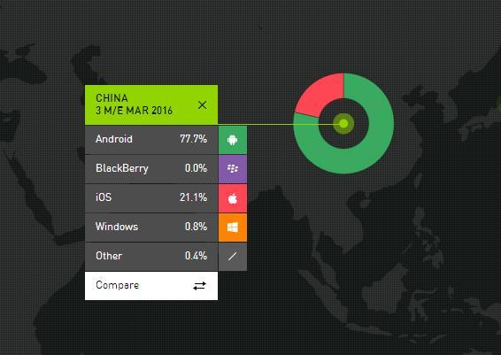

#### Android 系统版本分布

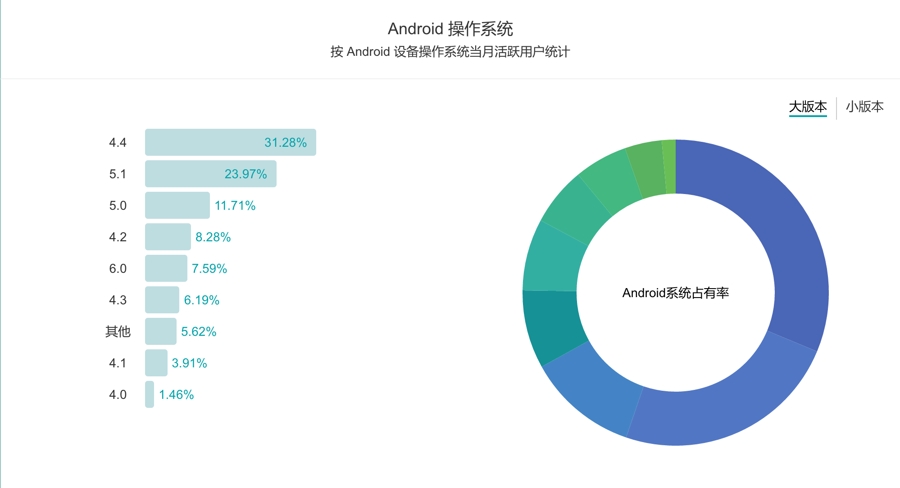

#### Android 屏幕分辨率

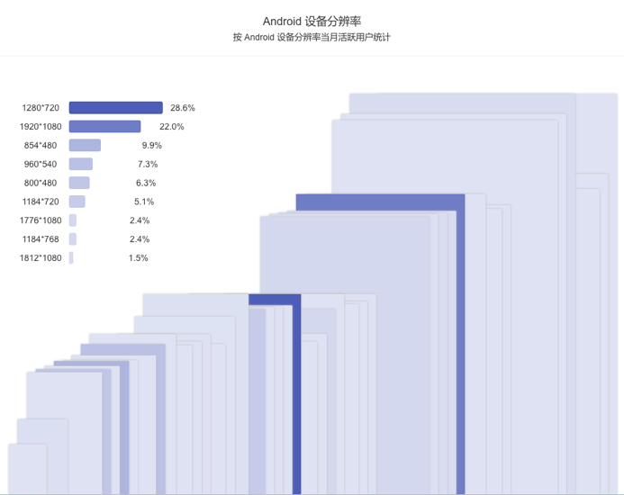

#### 原生和H5对比

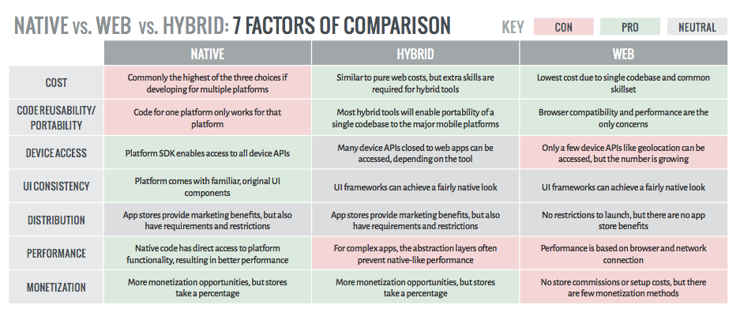

## Android 开发

###### 系统架构图

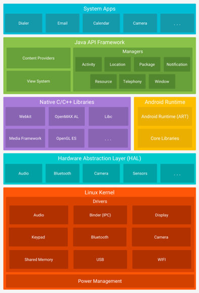

#### Android 开发流程

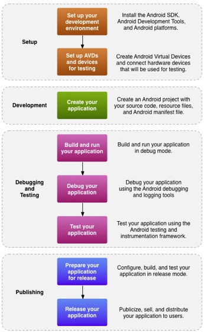 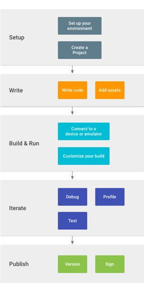

#### 开发介绍

 主要开发语言 Java 和 c/c++ 

## Android 四大组件

#### Activity

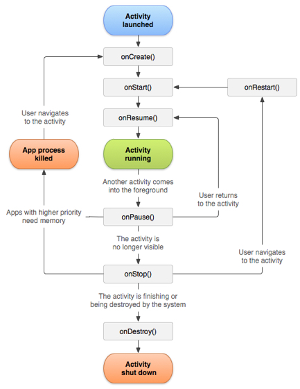 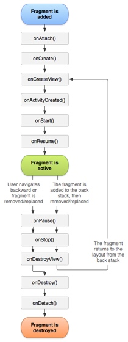

#### Service

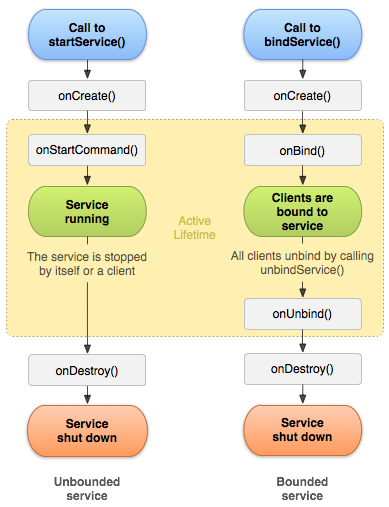

#### Broadcast Receiver

通信 解耦

> 组件 | ANR 时间
> ---|---
> Broadcast | 10s
> Activity | 5s

#### Content Provider

跨进程(跨应用)数据访问

## 测试

#### 测试工具

[Monkey](http://ihongqiqu.com/2015/12/24/Android-Monkey-Test/) 
[Monkeyrunner](http://ihongqiqu.com/2015/12/25/Android-monkeyrunner/) 
[Instrumentation](http://ihongqiqu.com/2016/01/07/android-instrumentation/) 
[Junit](https://developer.android.com/training/testing/start/index.html) 

#### Junit & Instrumentation

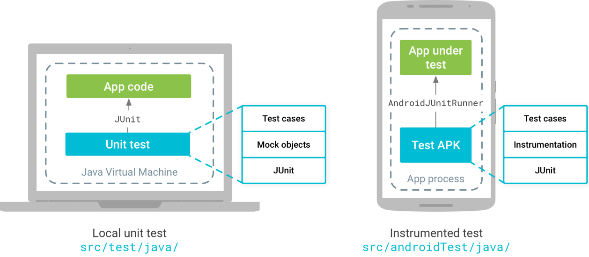

#### 测试框架

## Android 安全隐患

#### 安全问题分类

1. 本地数据存储安全
2. 客户端配置安全
3. 组件安全
4. 数据传输安全
5. 上线内控安全
6. 业务安全
7. 安全增强

#### 安全问题思维导图

  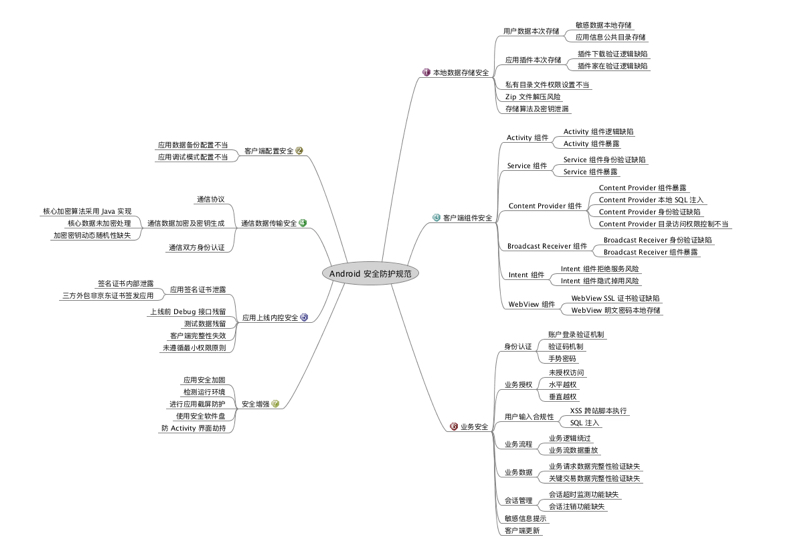

## 趋势

#### 热点

 热补丁  VR/AR   WebApp   微信小程序

## Thanks
