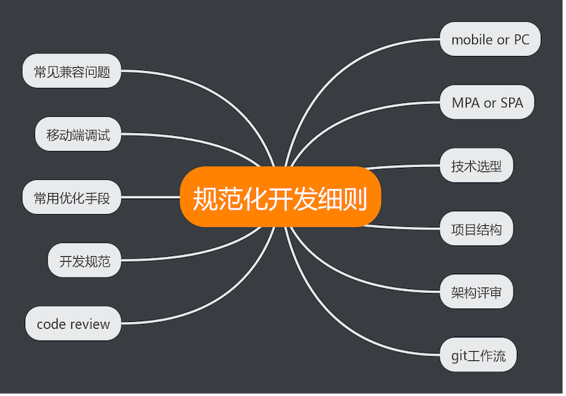
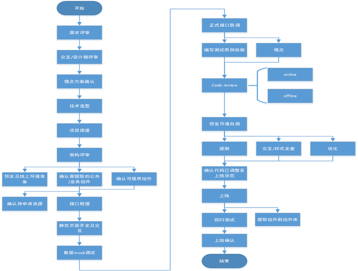

# 前端总结

## 介绍

1. 工作介绍
2. 组件库、分享和总结
3. 工作流程总结
4. 关键节点
5. 待发展

## 1. 工作介绍

### 1.1 房产

1. 新房
2. 租房
3. 二手房
4. 查房价
5. 地图找房
6. 贷款计算器
7. ...

### 1.2 拍卖

1. 降价拍
2. 趣京拍(令牌拍)
3. 降价拼拍
4. 拍卖小程序
5. 天秤微程序
6. 电子送达小程序
7. 京麦古玩城
8. 商家后台前后端分离
9. ...

## 2. 组件库、分享和总结

### 2.1 常用组件

1. 地址
2. 评分
3. PC 分页
4. 地图
5. 区间选择滑块
6. 文本框

### ElementUI 二次开发京东风格商家后台组件

### 2.2 分享

1. 小程序系列
2. JDReact 系列
3. 构建工具系列
4. NodeJs 系列

### 2.3 总结

1. [前端入过的坑总结](https://cf.jd.com/pages/viewpage.action?pageId=112453237)
2. [兼容性问题总结](https://cf.jd.com/pages/viewpage.action?pageId=184228760)
3. [原生交互总结](https://cf.jd.com/pages/viewpage.action?pageId=165584727)

### [往期分享文档链接](https://cf.jd.com/pages/viewpage.action?pageId=110406757) [前端博客 https://blog.jd.com/](https://blog.jd.com/)

## 3. 工作流程总结

### 3.1 工作流程

### 3.2 开发规范

## 4. 关键节点

1. 开发流程(代码管理、编码规范、README)
2. 上线流程(灰度原则、BackUp原则)

## 5. 规划发展

1. 开发流程和规范细则落地
2. 前端上线流程优化

