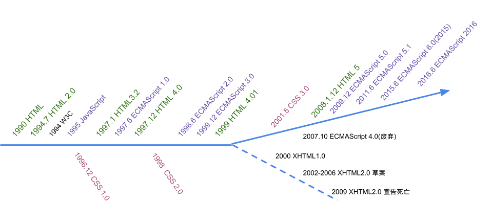
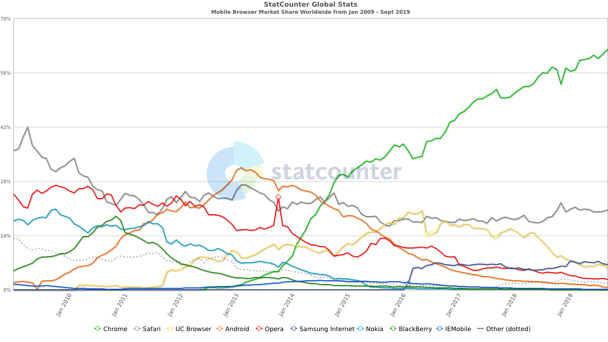

# 前端变迁史

### 个人介绍

* 产品研发部-前端研发部
* [靳振国](https://ihongqiqu.com/)
* Github：[jingle1267](https://github.com/jingle1267)

## 前言

### 前端标准发展史

### 分享主要内容

1. 原始社会
2. 石器时代
3. 铁器时代
4. 工业时代
5. 前端拓展

## 1. 原始社会

### 1.1 图示

### 1.2 形象

### 1.3 主要特征

1. 响应时间较长，小操作都需要刷整个页面
2. 页面简陋

### 1.4 重要元素

1. 1990 年 Netscape 浏览器
2. 1991 年 WWW 诞生
3. 1994 W3C 成立

## 2. 石器时代

### 2.1 图示

### 2.2 形象图

### 2.3 主要特征

1. 页面还是需要整体刷新
2. 页面变漂亮了
3. HTML 为骨架，CSS 为外貌，Java 为交互。

### 2.4 重要元素

1. PHP/JSP/ASP.NET
2. CSS

## 3. 铁器时代

### 3.1 图示

### 3.2 形象

### 3.3 主要特征

1. 支持异步请求，不用刷整个页面(Ajax 1998 创建-2006 纳入W3C)
2. 前端不再是模板
3. HTML 为骨架，CSS 为外貌，Java和 JavaScript 为交互。

### 3.4 重要元素

1. 浏览器兼容
2. Ajax
3. jQuery

## 4. 工业时代

### 4.1 图示

### 4.2 形象图

### 4.3 主要特征

1. 页面变得越来越复杂
2. 对用户体验要求越来越高
3. 前端开发变立体
4. 模块化/工程化
5. 技术后端化(MVVM，nginx，lua)
6. 后端微服务 / 前端更多业务逻辑

### 4.4 重要元素

1. Angular/React/Vue
2. MVVM
3. 前端更多的原生能力
4. HTML5
5. CommonJS / AMD(requireJS) / CMD(SeaJS) / ES6

### 4.5 相对铁器时代变化

## 5. 前端拓展

### 5.1 浏览器近代史

#### 5.1.1 全球浏览器

#### 5.1.2 全球浏览器M

####  5.1.3 中国浏览器

#### 5.1.4 中国浏览器M

### 5.2 前端知识体系

### 5.3 从前端走向全端

1. node
2. react native
3. 小程序
4. PWA
5. ...

## 谢谢

